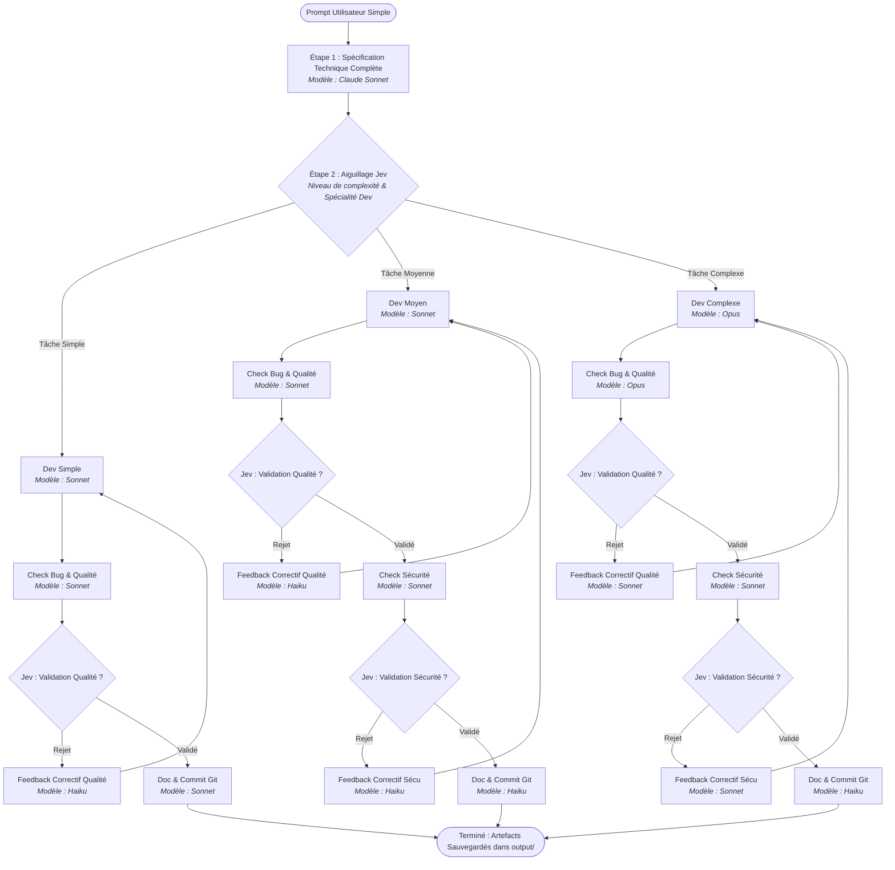

# 🤖 Workflow-Claude-Code : Orchestrateur Multi-Agents Claude & TypeSafe Jev

[](https://www.python.org/downloads/)
[](https://github.com/GirardotN/Workflow-Claude-Code)
[](https://docs.anthropic.com/en/docs/agents-and-tools/claude-code/overview)
[](https://typesafe.ai)
[](#-contraintes-fondamentales--z%C3%A9ro-cr%C3%A9dit-api-claude)
[](LICENSE)

Orchestrateur multi-agents autonome sous forme de machine à états finis, conçu pour automatiser le cycle complet de conception logicielle (spécification technique, développement spécialisé, contrôle qualité, audit de sécurité, documentation et message de commit Git).

Le projet tire parti des modèles de pointe **Claude** (Opus, Sonnet, Haiku) via le CLI local **Claude Code** en mode headless (`claude -p`), tout en déléguant le routage dynamique et les décisions de validation binaires au moteur décisionnel haute performance **TypeSafe Jev**.

Le code est **100 % multiplateforme** et fonctionne de manière transparente sous **Linux**, **macOS** et **Windows**.

---

## 🎯 Contraintes Fondamentales & Architecture

### 1. Zéro crédit d'API Claude Développeur
* **Principe :** L'utilisateur dispose d'un abonnement **Claude Max 5x** offrant un usage illimité (dans les limites de session) du CLI **Claude Code**.
* **Implémentation :** Aucune clé `ANTHROPIC_API_KEY` payante n'est nécessaire ni instanciée. Toutes les sollicitations de Claude sont exécutées via des sous-processus locaux non-interactifs (`claude -p "<prompt>" --model <model>`).

### 2. Aiguillage & Décisions Rapides via TypeSafe Jev
* **Principe :** Les arbitrages fins (choix du niveau de complexité, sélection de la spécialité technique du développeur, validation/rejet binaire qualité et sécurité) sont confiés au modèle décisionnel **Jev** (TypeSafe System One / Decide).
* **Avantage :** Latence ultra-faible, format de réponse déterministe (classification `choice` ou probabilité binaire `noul`/`binary`) et économie substantielle de tokens.

### 3. Isolation Stricte des Contextes & Préservation des Tokens
Pour éviter tout biais de confirmation et empêcher l'explosion de la fenêtre de contexte :
* L'**Agent Qualité** ne reçoit **que** le code source généré (aucune vue sur la spécialité ou la spec initiale).
* L'**Agent Sécurité** reçoit **le code source ET la review qualité** préalable.
* Les **Prompts de feedback correctifs** sont synthétisés sous forme de listes à puces concises pour réinjecter le strict minimum nécessaire au développeur en cas de rejet.

### 4. Garde-fou Anti-Boucle (Circuit Breaker)
* Un compteur de cycles (`MAX_WORKFLOW_RETRIES`) plafonne le nombre d'allers-retours entre le développement et les revues en cas de rejet persistant, évitant ainsi toute consommation incontrôlée.

### 5. Compatibilité Multiplateforme Native (Linux, macOS, Windows)
* **Windows CMD / PowerShell :** Prise en charge native des scripts batch npm (`claude.cmd`) via `shell=True` automatique sous Windows.
* **Encodage UTF-8 universel :** Décodage explicite en UTF-8 avec gestion des erreurs de remplacement pour éviter les erreurs `UnicodeDecodeError` (page de code Windows CP1252 / CP850).
* **Reconfiguration console :** `sys.stdout` et `sys.stderr` sont configurés pour afficher correctement les caractères accentués et les emojis sous les consoles Windows (cmd.exe, PowerShell, Windows Terminal).
* **Détection automatique des chemins :** Recherche intelligente du binaire `claude` dans le `PATH`, les répertoires npm Linux/macOS ainsi que `%APPDATA%\npm`, `%LOCALAPPDATA%` et `Program Files`.
* **Chargement résilient du `.env` :** Supporte `python-dotenv` tout en intégrant un parseur de secours natif sans aucune dépendance externe requise.

---

## 🔄 Diagramme du Workflow Multi-Agents



---

## 📊 Matrice des Rôles et Modèles

| Étape / Rôle | Tâche Simple | Tâche Moyenne | Tâche Complexe |
| :--- | :--- | :--- | :--- |
| **1. Spécification Technique** | Sonnet | Sonnet | Sonnet |
| **2. Routage & Spécialité Dev** | Jev (`choice`) | Jev (`choice`) | Jev (`choice`) |
| **3. Agent de Développement** | **Sonnet** | **Sonnet** | **Opus** |
| **4. Check Bug / Qualité** | **Sonnet** | **Sonnet** | **Opus** |
| **5. Décision Qualité** | Jev (`noul`/`binary`) | Jev (`noul`/`binary`) | Jev (`noul`/`binary`) |
| **6. Feedback Qualité (si rejet)** | **Haiku** | **Haiku** | **Sonnet** |
| **7. Check Sécurité** | *(Non exécuté)* | **Sonnet** | **Sonnet** |
| **8. Décision Sécurité** | *(Non exécuté)* | Jev (`noul`/`binary`) | Jev (`noul`/`binary`) |
| **9. Feedback Sécurité (si rejet)**| *(Non exécuté)* | **Haiku** | **Sonnet** |
| **10. Documentation & Commit Git**| **Sonnet** | **Haiku** | **Haiku** |

---

## 📁 Structure du Projet

```text
.
├── cli.py                     # Point d'entrée CLI (arguments, mode batch -y, gestion branches et encodage UTF-8)
├── orchestrator.py            # Moteur FSM, isolation par branche Git, boucle de feedback de tests et circuit breaker
├── models.py                  # Modèles de données typés (WorkflowType, DevSpecialty, StepRecord, Report)
├── config.py                  # Configuration globale, détection automatique de Claude Code et parser .env / JSON
├── clients/
│   ├── __init__.py            # Initialisation formelle du paquet clients
│   ├── claude_cli.py          # Wrapper headless Claude Code (parser lexical JSON à balance d'accolades)
│   ├── jev_client.py          # Client API HTTP TypeSafe Jev (System One / Decide + mock heuristique)
│   ├── git_client.py          # Gestion Git (isolation transactionnelle, intent-to-add, diff, rollback, merge)
│   └── test_runner.py         # Détecteur multi-écosystèmes et exécuteur de tests (pytest, npm, cargo, go)
├── ui/
│   ├── __init__.py            # Initialisation du paquet ui
│   └── terminal.py            # Spinner animé dynamique, diff coloré ANSI et confirmations interactives
├── tests/
│   ├── test_orchestrator.py   # Tests unitaires des branches, circuit breaker, typage et isolation cognitive
│   ├── test_in_repo.py        # Tests du mode In-Repo (modifications in-situ, rollback, auto-commit, untracked)
│   └── test_test_runner.py    # Tests de détection et d'exécution du runner de tests
├── output/                    # Dossier des artefacts persistés (patchs, documentation, rapports)
├── pyproject.toml             # Configuration standard PEP 621 et points d'entrée console (workflow, workflow-claude)
├── requirements.txt           # Dépendances Python minimales (requests, python-dotenv)
├── LICENSE                    # Licence MIT
├── .env.example               # Modèle des variables d'environnement
└── .gitignore                 # Exclusions Git
```

---

## 🚀 Installation & Prérequis

### 1. Prérequis Généraux
* **Python 3.10 ou supérieur**
* **Node.js** (requis pour installer le CLI Claude Code)
* Un compte **Claude Max 5x** ou Claude Pro avec session active.
* Une clé API **TypeSafe** pour le modèle Jev (optionnel : un mode simulation/mock heuristique est activé automatiquement si aucune clé n'est fournie).

---

### 2. Guide d'Installation par Système d'Exploitation

#### 📦 Installation Recommandée (Globale via `pipx`)

Grâce à `pyproject.toml`, l'orchestrateur s'installe en commande système universelle :

```bash
# 1. Cloner le dépôt
git clone https://github.com/GirardotN/Workflow-Claude-Code.git
cd Workflow-Claude-Code

# 2. Installer globalement dans un environnement isolé sans conflit
pipx install --editable .

# 3. La commande `workflow` ou `workflow-claude` est immédiatement disponible partout !
workflow "Modifie la fonction de tri dans l'onglet x"
```

#### 🐧 Linux & 🍎 macOS (Environnement Virtuel Classique)

```bash
# 1. Installer et connecter Claude Code CLI
npm install -g @anthropic-ai/claude-code
claude auth login

# 2. Cloner le dépôt et créer l'environnement virtuel
git clone https://github.com/GirardotN/Workflow-Claude-Code.git
cd Workflow-Claude-Code
python3 -m venv venv
source venv/bin/activate

# 3. Installer les dépendances
pip install -r requirements.txt
```

#### 🪟 Windows (PowerShell ou Invite de commandes CMD)

```cmd
:: 1. Installer et connecter Claude Code CLI
npm install -g @anthropic-ai/claude-code
claude auth login

:: 2. Cloner le dépôt et créer l'environnement virtuel
git clone https://github.com/GirardotN/Workflow-Claude-Code.git
cd Workflow-Claude-Code
python -m venv venv
venv\Scripts\activate

:: 3. Installer les dépendances
pip install -r requirements.txt
```

> **Note Windows :** Le CLI `claude` est automatiquement résolu sous Windows sous la forme `claude.cmd`. L'orchestrateur configure automatiquement l'interpréteur et la console en encodage UTF-8.

---

## ⚙️ Configuration (`.env` ou `config.json`)

### 1. Variables d'environnement (`.env`)
Copiez le modèle [.env.example](.env.example) vers `.env` :

```bash
cp .env.example .env     # Linux / macOS
copy .env.example .env   # Windows
```

| Variable | Description | Valeur par défaut |
| :--- | :--- | :--- |
| `TYPESAFE_API_KEY` | Clé API pour TypeSafe Jev (obtenue sur [typesafe.ai](https://typesafe.ai)) | `""` *(active le mock heuristique si vide)* |
| `TYPESAFE_API_URL` | Endpoint officiel TypeSafe System One | `https://api.typesafe.ai/v1/systemone` |
| `TYPESAFE_FALLBACK_URL` | Endpoint de secours TypeSafe Decide direct | `https://api.typesafe.ai/v1/decide` |
| `CLAUDE_BIN` | Chemin absolu personnalisé vers le binaire `claude` | Détection automatique (`PATH`, version locale) |
| `CLAUDE_TIMEOUT_SECONDS` | Délai d'expiration maximum par appel au CLI Claude | `180` |
| `MAX_WORKFLOW_RETRIES` | Nombre maximum de cycles de feedback (Circuit Breaker) | `4` |
| `ALLOW_BASH` | Autoriser l'outil Bash par défaut (`1` ou `0`) | `0` *(sécurité renforcée)* |
| `USE_BRANCH` | Isoler le travail sur une branche dédiée (`1` ou `0`) | `1` *(protection de main)* |
| `RUN_TESTS` | Exécuter la suite de tests du projet hôte (`1` ou `0`) | `1` *(oracle de vérité)* |
| `MOCK_SERVICES` | Activer la simulation intégrale sans appel réseau/CLI (`1` ou `0`) | `0` |

### 2. Préférences utilisateur (`~/.config/workflow-claude/config.json`)
Vous pouvez également créer un fichier JSON persistant pour mémoriser vos préférences globales :
```json
{
  "allow_bash": false,
  "run_tests": true,
  "use_branch": true
}
```

---

## 💻 Guide d'Utilisation

### 1. Mode In-Repo sur un Projet Existant (Recommandé)

Déployez l'orchestrateur sur une base de code existante comportant des dizaines de fichiers. Le workflow :
1. Crée une branche d'isolation `workflow/ai-<timestamp>` pour ne pas altérer votre branche active.
2. Filtre automatiquement `node_modules`, `.git`, `.venv` pour une exploration ultra-rapide.
3. Modifie chirurgicalement les fichiers in-situ.
4. Lance la suite de tests du projet (`pytest`, `npm test`) et auto-corrige le code en cas d'erreur.
5. Valide le résultat sur le `git diff` avec audit Qualité & Sécurité Jev.
6. Propose la fusion automatique dans la branche principale.

```bash
# Exploration, modification in-situ et revue sur branche dédiée :
workflow --project-dir /chemin/vers/mon-projet "Modifie la fonction de tri dans l'onglet x"

# Option --commit et --merge : Commiter et fusionner automatiquement dans la branche principale
workflow --project-dir /chemin/vers/mon-projet --commit --merge -y "Modifie la fonction de tri dans l'onglet x"
```

### 2. Mode Standalone (Génération d'un fichier neuf)

Pour générer un module autonome sans intervenir sur un projet existant :

```bash
workflow --standalone "Créer un service FastAPI d'authentification JWT avec rate limiting Redis"
```

### 3. Mode Simulation / Hors Ligne (`--mock`)

Le mode `--mock` permet de tester le flux de la machine à états instantanément sans consommer d'appels :

```bash
workflow --mock --project-dir /chemin/vers/mon-projet "Modifie la fonction de tri dans l'onglet x"
```

### 4. Options de la Ligne de Commande

```text
usage: workflow [-h] [--mock] [--max-retries MAX_RETRIES] [--project-dir PROJECT_DIR]
                [--standalone] [--commit] [--branch] [--no-branch] [--merge]
                [--allow-bash] [--run-tests] [--no-tests] [-y] [--workspace WORKSPACE] [-v]
                [prompt]

Options principales :
  prompt                 Prompt simple décrivant la tâche de développement ou de refactoring
  --project-dir DOSSIER  Répertoire du projet cible (active le mode In-Repo)
  --commit               Créer automatiquement le commit Git conventionnel après validation
  --branch / --no-branch Isoler le travail sur une branche dédiée workflow/ai-* (défaut: activé)
  --merge                Fusionner automatiquement la branche d'isolation dans main en cas de succès
  --run-tests / --no-tests Exécuter la suite de tests du projet hôte (pytest, npm test, etc.)
  --allow-bash           Autoriser l'outil Bash pour Claude (défaut: désactivé pour sécurité)
  -y, --yes              Accepter automatiquement les confirmations sans invite interactive
  --mock                 Exécuter en mode simulation déterministe
  --standalone           Forcer le mode fichier unique dans output/
  -v, --verbose          Activer les logs détaillés de débogage
```

---

## 📂 Artefacts Générés

À la fin de chaque exécution validée, les fichiers suivants sont persistés dans `./output` :

1. **`LATEST_PATCH.diff`** *(Mode In-Repo)* : Le patch Git exact appliqué aux fichiers du projet.
2. **`generated_solution.<ext>`** *(Mode Standalone)* : Le code source complet produit.
3. **`GENERATED_DOC.md`** : La documentation technique et le commit conventionnel proposé.
4. **`WORKFLOW_AUDIT.md`** : Le journal d'audit chronométré de toutes les étapes et validations.

---

## 🧪 Tests Unitaires

Une suite de 20 tests unitaires automatisés couvre l'ensemble des scénarios :

```bash
python3 -m unittest discover -s tests -v
```

Résultat :
```text
Ran 20 tests in 0.682s

OK
```

---

## 🛡️ Sécurité & Bonnes Pratiques

* **Confidentialité locale :** Le CLI Claude Code s'exécute localement sur votre poste au sein de votre session active.
* **Séparation stricte des privilèges :** Les agents de test et d'audit n'ont pas accès aux prompts de spécification ou aux instructions internes du développeur.
* **Typage et maintenabilité :** Le projet utilise un typage Python rigoureux (`dataclasses`, `Enum`, annotations de types) facilitant son intégration dans des pipelines CI/CD.

---

## 📄 Licence

Ce projet est distribué sous licence MIT. Consultez le fichier `LICENSE` pour plus de détails.
