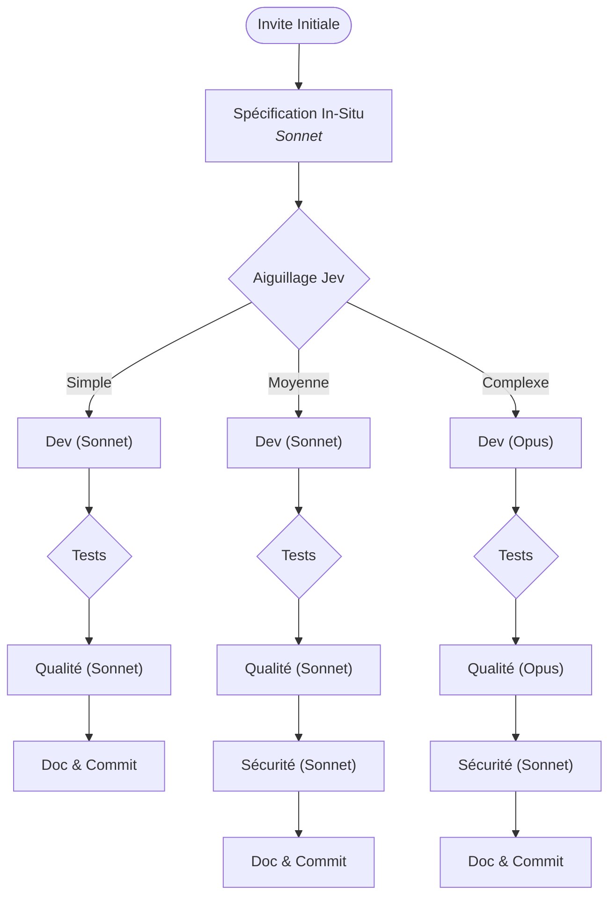

# Workflow-Claude-Code : Orchestrateur Multi-Agents Claude & TypeSafe Jev

[](https://www.python.org/downloads/)
[](https://github.com/GirardotN/Workflow-Claude-Code)
[](https://github.com/GirardotN/Workflow-Claude-Code/actions)
[](https://docs.anthropic.com/en/docs/agents-and-tools/claude-code/overview)
[](https://typesafe.ai)
[](#-contraintes-fondamentales--z%C3%A9ro-cr%C3%A9dit-api-claude)
[](LICENSE)

**`Workflow-Claude-Code` est un orchestrateur multi-agents autonome basé sur une Machine à États Finis (FSM) déterministe qui automatise l'intégralité du cycle de conception logicielle : spécification technique, développement in-situ, oracle de tests automatisé, double audit qualité & sécurité, documentation d'ingénierie et commit sémantique.**

Conçu pour les ingénieurs logiciels exigeants et les équipes produit en entreprise, il réconcilie la puissance générative des modèles de pointe d'Anthropic (**Opus, Sonnet, Haiku**) et la vélocité déterministe du moteur de décision **TypeSafe Jev** (System One / Decide).

Il neutralise définitivement les écueils critiques des agents autonomes conventionnels : **zéro crédit API développeur consommé** grâce à l'exploitation de la session locale Claude CLI (Claude Pro / Max 5x), **zéro perte de données** grâce au mécanisme de sécurité **Stash Guard**, et **zéro hallucination de régression** grâce à un diagnostic initial par **Oracle de Test (Baseline Cycle 0)**.

---

### Tableau Comparatif Synthétique

| Dimension Critique | Développement Manuel | Scripts d'Agents Naïfs (LLM Wrapper) | **Workflow-Claude-Code** |
| :--- | :--- | :--- | :--- |
| **Coût d'API Claude** | Gratuit (abonnement web) mais chronophage | Facturation exponentielle au token (`ANTHROPIC_API_KEY`) | **0 € de crédits API** (Session locale Claude CLI Max 5x) |
| **Sécurité du Code Local** | Totale (contrôle humain) | **Élevée** (risque d'écrasement ou destruction par `git clean -fd`) | **Hermétique (Stash Guard)** : `git stash` + `finally: git stash pop` |
| **Validation des Tests** | Manuelle | Ignorée ou aveugle aux échecs préexistants | **Oracle Baseline (Cycle 0)** avec auto-guérison et normalisation anti-jitter |
| **Isolation Cognitive** | Dépend de la rigueur du relecteur | Contexte saturé provoquant des biais de confirmation | **Isolation Stricte** : La revue qualité ne voit que le code brut ou le diff |
| **Vitesse d'Arbitrage** | Lente (attente de review humaine) | Lente (invocations LLM coûteuses pour un oui/non) | **Instantanée & Déterministe** via TypeSafe Jev (classification/probabilité) |
| **Gestion Multiplateforme** | Manuelle | Souvent bloqué sous Windows (`claude.cmd`, encodage CP1252) | **Universelle** (Linux, macOS, Windows avec `comspec` sécurisé & UTF-8) |
| **Résilience du Parsing** | N/A | Crashe si du code généré contient des accolades `{}` | **Parseur lexical d'accolades équilibrées** insensible aux imbrications |
| **Empreinte Système** | N/A | Bloatware lourd (LangChain, autogen, 50+ dépendances) | **Zero Bloatware** : Seulement 2 dépendances légères (`requests`, `dotenv`) |

---

## Démarrage Rapide (Quickstart en 3 Minutes)

### 1. Prérequis Système
- **Node.js (v18+)** : Requis pour faire tourner le CLI officiel Claude Code.
- **Python 3.10 ou supérieur**.
- **Session Claude active** : Installez et authentifiez votre session Claude Pro / Max 5x :
  ```bash
  npm install -g @anthropic-ai/claude-code
  claude auth login
  ```

> [!NOTE]
> Une clé API **TypeSafe** pour le modèle Jev est facultative. Si aucune variable `TYPESAFE_API_KEY` n'est configurée, l'orchestrateur active automatiquement son simulateur heuristique local haute performance.

---

### 2. Installation Recommandée (Globale via `pipx`)

Grâce au standard **PEP 621** configuré dans `pyproject.toml`, l'application s'installe en commande système universelle isolée :

```bash
# 1. Cloner le dépôt officiel
git clone https://github.com/GirardotN/Workflow-Claude-Code.git
cd Workflow-Claude-Code

# 2. Installer globalement via pipx en mode éditable
pipx install --editable .

# 3. La commande est immédiatement disponible partout !
workflow --help
```

---

### 3. Exemples d'Exécution

```bash
# Mode In-Repo : Exploration, modification in-situ et revue sur branche dédiée
workflow --project-dir /chemin/vers/mon-projet "Modifie la fonction de tri dans l'onglet x"

# Mode Autonome : Génération d'un fichier neuf dans output/
workflow --standalone "Créer un service FastAPI d'authentification JWT avec rate limiting Redis"

# Mode Simulation Déterministe (sans appel réseau ni CLI)
workflow --mock "Test de flux"
```

---

## Flux FSM en Bref

L'orchestrateur évalue le niveau de complexité de la demande après spécification in-situ et applique une séparation stricte des rôles :



---

## Documentation Technique Complète

Pour explorer tous les détails architecturaux, les guides avancés et la référence d'ingénierie, consultez la documentation modulaire :

| Document | Description |
| :--- | :--- |
| **[Architecture & Modèle Mental](docs/architecture.md)** | Diagrammes Mermaid détaillés (FSM complète, séquence Stash Guard), matrice d'allocation des modèles et isolation cognitive. |
| **[Guide d'Utilisation Avancé (Cookbooks)](docs/cookbooks.md)** | Cas réels : Refactoring in-situ React/TS avec `git add -N`, correction TDD FastAPI avec auto-réparation, et pipelines CI/CD batch. |
| **[Référence des Paramètres & Configuration](docs/configuration.md)** | Tableau exhaustif des arguments CLI, variables d'environnement `.env`, configuration JSON et priorité de résolution. |
| **[Sous le Capot : Ingénierie & Sécurité](docs/under-the-hood.md)** | Analyse technique approfondie : Stash Guard inconditionnel, Oracle Baseline Cycle 0 avec normalisation anti-jitter, sécurisation sous Windows et parseur lexical. |
| **[Dépannage, FAQ & Diagnostics](docs/troubleshooting.md)** | Diagnostic des erreurs courantes (binaire introuvable, session expirée, conflits de stash, Circuit Breaker). |

---

## Tests Unitaires & Intégration Continue (CI/CD)

Le projet intègre une suite de **27 tests unitaires hermétiques** (100 % de succès) validant chaque composant sans dépendance externe :
```bash
python3 -m unittest discover -s tests -v
```

### Matrice CI/CD GitHub Actions (`.github/workflows/ci.yml`)
Chaque commit et pull request est testé sur une matrice **9 environnements** :
- **Systèmes d'exploitation :** Ubuntu Linux, macOS, Windows
- **Versions Python :** 3.10, 3.11, 3.12

---

## Licence

Ce projet est distribué sous **Licence MIT**. Consultez le fichier [LICENSE](LICENSE) pour plus de détails.  
Créé et maintenu par **Nicolas Girardot** (`nicolasgirardot60@gmail.com`).
