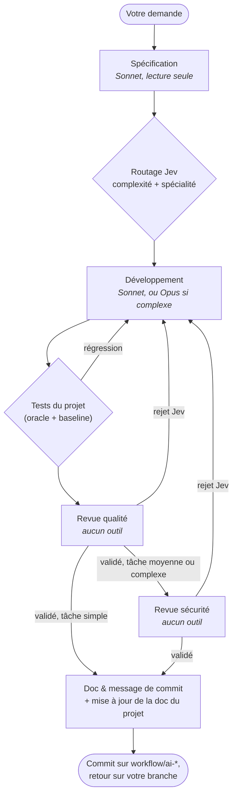

# Workflow-Claude-Code : Orchestrateur Multi-Agents Claude & TypeSafe Jev

[](https://www.python.org/downloads/)
[](docs/windows.md)
[](https://github.com/GirardotN/Workflow-Claude-Code/actions)
[](https://docs.anthropic.com/en/docs/agents-and-tools/claude-code/overview)
[](https://typesafe.ai)
[](docs/under-the-hood.md#3-appels-à-claude--prompt-sur-stdin-environnement-nettoyé-outils-par-rôle)
[](LICENSE)

`workflow` confie une tâche de programmation à une **chaîne d'agents Claude** pilotée par une machine à états : spécification, développement dans votre dépôt, tests, double revue (qualité puis sécurité), mise à jour de la documentation et commit. Les décisions « oui/non » (le travail est-il valide ?) et le routage (tâche simple, moyenne ou complexe) sont confiés au service de décision **TypeSafe Jev**, pas à Claude lui-même.

> **État : alpha (0.1.x).** La mécanique est testée de bout en bout avec des doubles réalistes (≈ 400 tests, couverture ≈ 96 %), et le client Jev a été validé contre le service réel. Un run complet avec un Claude authentifié reste à faire manuellement : commencez sur un **dépôt jetable** (voir [Limites connues](#limites-connues)).

---

## Ce que l'outil garantit (et où c'est vérifié)

| Promesse | Mécanisme | Vérifié par |
| :--- | :--- | :--- |
| **Votre travail en cours n'est jamais perdu** | Mise en réserve (`git stash -u`), branche d'isolation `workflow/ai-*`, rollback, retour sur votre branche **puis** restauration du stash — sur succès, échec, erreur, timeout et Ctrl-C | `test_isolation.py`, `test_git_client.py`, `test_edge_cases.py` (vrais dépôts Git) |
| **Aucune facturation à l'usage par erreur** | `ANTHROPIC_API_KEY`, `ANTHROPIC_AUTH_TOKEN`, `ANTHROPIC_BASE_URL`, Bedrock/Vertex/Foundry sont retirées de l'environnement du sous-processus Claude (sauf `--allow-api-key`) | `test_claude_cli.py` |
| **Les relecteurs ne voient que le diff** | Les agents qualité, sécurité, feedback et doc n'ont **aucun outil** et tournent dans un répertoire vide | `test_tool_policy.py` |
| **Une validation n'est jamais un accident** | Jev est *fail-closed* : réponse absente, invalide ou service en panne = arrêt du workflow ; sans clé TypeSafe, refus de démarrer | `test_jev_client.py` (serveur au format réel) |
| **Les secrets ne partent pas chez un tiers** | Masquage (clés, jetons, mots de passe, JWT, clés privées…) avant envoi à Jev ; `--jev-send review-only` n'envoie aucun code | `test_jev_context.py` |
| **Un échec de tests préexistant n'est pas une régression** | Comparaison d'**ensembles de tests en échec** avec la baseline initiale | `test_oracle.py` |
| **La documentation se met à jour sans toucher au code** | Agent doc + garde-fou qui annule tout ce qui n'est pas de la documentation | `test_doc_edit.py` |
| **Un échec laisse une trace exploitable** | `WORKFLOW_AUDIT.md`, `report.json`, dernière tentative, codes de sortie distincts | `test_cli_ux.py` |

Ces garanties ont des limites ; elles sont détaillées dans [Limites connues](#limites-connues) et [SECURITY.md](SECURITY.md).

---

## Démarrage rapide

> **Première fois ?** Suivez le tutoriel pas à pas : **[docs/getting-started.md](docs/getting-started.md)** (10 minutes, sur un dépôt jetable, avec les résultats attendus). Les termes techniques sont expliqués dans le [glossaire](docs/glossaire.md).

**Qu'est-ce que Jev ?** Un service externe ([typesafe.ai](https://typesafe.ai)) qui répond « oui/non » (avec une probabilité) à la question « ce travail est-il valide ? » et classe la complexité des tâches. Il faut y créer un compte pour obtenir une clé API.

### 1. Prérequis
- **Git**, avec une identité configurée (`git config --global user.name` / `user.email`).
- **Python 3.10+**.
- **Node.js 18+** et le CLI officiel, **authentifié avec votre abonnement** :
  ```bash
  npm install -g @anthropic-ai/claude-code
  claude auth login
  ```
- Une **clé TypeSafe** (`TYPESAFE_API_KEY`) : créez-la sur [typesafe.ai](https://typesafe.ai), puis placez-la dans `~/.config/workflow-claude/.env` (Windows : `%USERPROFILE%\.config\workflow-claude\.env`) en copiant `.env.example` — ou dans un `.env` du dossier courant, ou en variable d'environnement. Sans elle, `workflow` refuse de démarrer ; `--mock` est le seul mode simulation.

### 2. Installation
```bash
git clone https://github.com/GirardotN/Workflow-Claude-Code.git
cd Workflow-Claude-Code
pipx install .          # ou : pipx install --editable .   (pour développer)
workflow --version
mkdir -p ~/.config/workflow-claude && cp .env.example ~/.config/workflow-claude/.env   # puis éditez la clé
workflow --doctor       # vérifie Git, CLI Claude, session, clé TypeSafe (aucun quota Claude consommé)
```
Sous Windows : voir [docs/windows.md](docs/windows.md).

### 3. Premiers pas

```bash
# Mode In-Repo : le projet doit être un dépôt Git (travail sur une branche dédiée, jamais sur la vôtre)
workflow --project-dir /chemin/vers/mon-projet "Modifie la fonction de tri dans l'onglet x"

# Mode Standalone : génère du code seul (un fichier) dans le dossier de rapports
workflow --standalone "Crée un service FastAPI d'authentification JWT"

# Simulation : sans réseau ni CLI ; validations NON fiables ; aucun fichier du projet modifié
workflow --mock --standalone "Test de flux"

# Sortie machine (CI) : rapport JSON sur stdout, affichage humain sur stderr
workflow --json --project-dir . "Ajoute un tri par date" > report.json
```

Le prompt est obligatoire. À la fin d'un run In-Repo réussi, les modifications sont **committées sur `workflow/ai-*`** et vous êtes ramené sur votre branche ; l'outil propose la fusion (`--merge` pour la faire automatiquement).

---

## Fonctionnement



Le détail (matrice des modèles, séquence Git, isolation cognitive) est dans [docs/architecture.md](docs/architecture.md). Un **circuit breaker** (`--max-retries`, 4 par défaut) arrête le workflow après trop d'allers-retours ; dans tous les cas d'échec le dépôt est remis en état.

### Codes de sortie

| Code | Signification |
| :--- | :--- |
| `0` | Succès |
| `1` | Erreur inattendue ou précondition non remplie (dépôt sans commit, identité Git absente, `--project-dir` invalide…) |
| `2` | Workflow terminé **sans succès** (circuit breaker, commit refusé…) — aussi : erreur d'usage des arguments |
| `3` | Claude : session absente, limite d'usage de l'abonnement atteinte, timeout |
| `4` | Jev : clé absente ou refusée, service indisponible, réponse invalide |
| `130` | Interruption (Ctrl-C) |

---

## Limites connues

- **Pas encore de validation automatisée avec un vrai Claude.** Le client est testé avec un faux binaire `claude` et le CLI réel a été sondé (`--help`, `auth status`, format JSON d'erreur). Faites un premier essai sur un dépôt jetable avant tout projet important.
- **Jev décide, avec une probabilité.** Le seuil de validation est 0,5 (`JEV_THRESHOLD`) et n'a pas été calibré sur de nombreux runs. Si un relecteur conclut `VERDICT: FAIL` alors que Jev valide, l'incohérence est journalisée (`report.decisions`) mais la décision de Jev s'applique.
- **Données envoyées à un tiers** : le diff (secrets masqués « au mieux » par expressions régulières) et la revue partent chez TypeSafe. `--jev-send review-only` n'envoie aucun code.
- **`--allow-bash` n'est pas un bac à sable** : liste blanche de commandes (tests, lecture) ; `pytest` exécute le code de votre projet.
- **Un run à la fois par dépôt** (branche, stash et index sont partagés). Un sous-module modifié ou un arbre qu'on ne peut pas mettre en réserve est refusé (votre travail n'est pas touché).
- **Conflit de fusion** : la fusion est abandonnée proprement et la branche `workflow/ai-*` est conservée pour inspection.
- **Tests du projet cible** : détection de Node (npm/pnpm/yarn/bun), Python, .NET, Maven, Gradle, Rust, Go ; sinon `--test-cmd`.
- **Mode Standalone** : un seul fichier de code, sans projet ni tests.
- **Quota** : les tâches complexes utilisent Opus et consomment votre abonnement ; la limite d'usage arrête proprement le workflow (code 3).
- **Langue** : prompts, logs et documentation sont en français.

---

## Documentation

| Document | Contenu |
| :--- | :--- |
| **[Prise en main (10 min)](docs/getting-started.md)** | Premier run pas à pas sur un dépôt jetable, avec les résultats attendus |
| [Glossaire](docs/glossaire.md) | Jev, baseline, stash, circuit breaker, isolation… en clair |
| [Architecture](docs/architecture.md) | FSM, séquence Git, matrice des modèles, étape DOC_EDIT |
| [Configuration](docs/configuration.md) | Options CLI, variables d'environnement, `.workflow.toml`, codes de sortie |
| [Sous le capot](docs/under-the-hood.md) | Stash Guard, oracle de tests, client Claude, Jev (format réel, fail-closed, masquage) |
| [Cookbooks](docs/cookbooks.md) | Scénarios d'usage (refactoring, TDD, CI) |
| [Dépannage](docs/troubleshooting.md) | Erreurs courantes et solutions |
| [Windows](docs/windows.md) | Installation et particularités sous Windows |
| [Tests](docs/testing.md) | Organisation, doubles de test, conventions, couverture |
| [Décisions d'architecture (ADR)](docs/adr/README.md) | Pourquoi CLI `claude -p`, rôle de Jev, isolation par branche, garde-fou de l'agent doc |
| [Sécurité](SECURITY.md) · [Contribuer](CONTRIBUTING.md) · [Changelog](CHANGELOG.md) | |

---

## Tests et intégration continue

```bash
pip install -e ".[dev]"                 # installation éditable requise (le code vit dans src/workflow_claude)
python -m unittest discover -s tests    # ≈ 400 tests hermétiques, ≈ 2-3 minutes
```
La CI (`.github/workflows/ci.yml`) exécute les tests sur **Ubuntu, macOS et Windows × Python 3.10, 3.11, 3.12**, un lint `ruff`, un test d'installation (`pip` et `pipx`) et un contrôle de couverture (seuil 90 %).

---

## Licence

Distribué sous **licence MIT** ([LICENSE](LICENSE)). Créé et maintenu par **Nicolas Girardot** (`nicolasgirardot60@gmail.com`).
