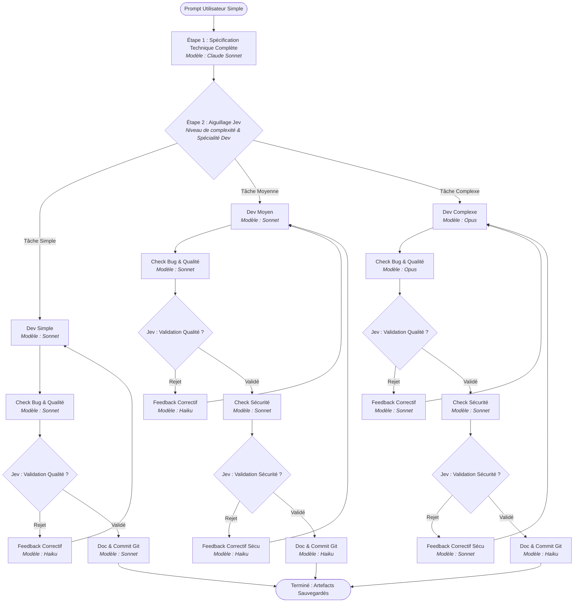

# 🤖 Workflow-Claude-Code : Orchestrateur Multi-Agents Claude & TypeSafe Jev

[](https://www.python.org/downloads/)
[](https://docs.anthropic.com/en/docs/agents-and-tools/claude-code/overview)
[](https://typesafe.ai)
[](#-contraintes-fondamentales--z%C3%A9ro-cr%C3%A9dit-api-claude)
[](LICENSE)

Orchestrateur multi-agents autonome sous forme de machine à états finis, conçu pour automatiser le cycle complet de conception logicielle (spécification, développement, audit qualité, audit sécurité, documentation et commit Git).

Le projet tire parti de la puissance des modèles **Claude** (Opus, Sonnet, Haiku) via le CLI local **Claude Code** en mode headless (`claude -p`), tout en déléguant le routage dynamique et les décisions de validation binaires au moteur décisionnel ultra-rapide **TypeSafe Jev**.

---

## 🎯 Contraintes Fondamentales & Architecture

### 1. Zéro crédit d'API Claude Développeur
* **Principe :** L'utilisateur dispose d'un abonnement **Claude Max 5x** offrant un usage illimité (dans les limites de session) du CLI **Claude Code**.
* **Implémentation :** Aucune clé `ANTHROPIC_API_KEY` n'est requise ni instanciée. Toutes les sollicitations de Claude sont exécutées via des sous-processus locaux non-interactifs (`claude -p "<prompt>" --model <model>`).

### 2. Aiguillage & Décisions Rapides via TypeSafe Jev
* **Principe :** Les arbitrages fins (choix de la complexité, attribution de la spécialité technique du développeur, validation/rejet qualité et sécurité) sont confiés au modèle décisionnel **Jev** (TypeSafe System One).
* **Avantage :** Latence minimale, format de sortie déterministe (classification ou probabilité binaire `noul`/`binary`) et économie de tokens.

### 3. Isolation Stricte des Contextes
Pour préserver la fenêtre de contexte et éviter tout biais de confirmation :
* L'**Agent Qualité** ne reçoit **que** le code source généré (aucune vue sur la spécialité ou la spec initiale).
* L'**Agent Sécurité** reçoit **le code source ET la review qualité** préalable.
* Les **Prompts de feedback correctifs** sont synthétisés sous forme de listes à puces concises pour réinjecter le strict minimum nécessaire au développeur.

### 4. Garde-fou Anti-Boucle (Circuit Breaker)
* Un compteur de cycles (`MAX_WORKFLOW_RETRIES`) plafonne le nombre d'allers-retours entre le développement et les revues en cas de rejet persistant, évitant ainsi toute boucle infinie.

---

## 🔄 Diagramme du Workflow Multi-Agents



---

## 📊 Matrice des Rôles et Modèles

| Étape / Rôle | Tâche Simple | Tâche Moyenne | Tâche Complexe |
| :--- | :--- | :--- | :--- |
| **1. Spécification Technique** | Sonnet | Sonnet | Sonnet |
| **2. Routage & Spécialité Dev** | Jev (`choice`) | Jev (`choice`) | Jev (`choice`) |
| **3. Agent de Développement** | **Sonnet** | **Sonnet** | **Opus** |
| **4. Check Bug / Qualité** | **Sonnet** | **Sonnet** | **Opus** |
| **5. Décision Qualité** | Jev (`noul`/`binary`) | Jev (`noul`/`binary`) | Jev (`noul`/`binary`) |
| **6. Feedback Qualité (si rejet)** | **Haiku** | **Haiku** | **Sonnet** |
| **7. Check Sécurité** | *(Non exécuté)* | **Sonnet** | **Sonnet** |
| **8. Décision Sécurité** | *(Non exécuté)* | Jev (`noul`/`binary`) | Jev (`noul`/`binary`) |
| **9. Feedback Sécurité (si rejet)**| *(Non exécuté)* | **Haiku** | **Sonnet** |
| **10. Documentation & Commit Git**| **Sonnet** | **Haiku** | **Haiku** |

---

## 📁 Structure du Projet

```text
.
├── cli.py                     # Point d'entrée en ligne de commande (CLI interactif et options)
├── orchestrator.py            # Moteur de machine à états et gestion des flux multi-agents
├── models.py                  # Modèles de données typés (WorkflowType, DevSpecialty, StepRecord, Report)
├── config.py                  # Configuration globale, détection automatique du binaire Claude et .env
├── clients/
│   ├── claude_cli.py          # Wrapper subprocess pour le CLI Claude Code headless (-p)
│   └── jev_client.py          # Client API HTTP TypeSafe Jev (System One / Decide + mock)
├── tests/
│   └── test_orchestrator.py   # Suite de tests unitaires (couverture complète des 3 branches)
├── output/                    # Dossier des artefacts persistés (code, doc, rapport d'audit)
├── sp_cification_proposition_d_architecture_multi_agents.md  # Spécification technique source
├── .env.example               # Modèle des variables d'environnement
├── requirements.txt           # Dépendances Python minimales
└── .gitignore                 # Exclusions Git (fichiers temporaires, venv, caches)
```

---

## 🚀 Installation & Prérequis

### 1. Prérequis Système
* **Python 3.10+**
* **Claude Code CLI** installé et authentifié sur votre machine :
  ```bash
  npm install -g @anthropic-ai/claude-code
  claude auth login
  ```
  *(Vérifiez que `claude -p "test"` fonctionne dans votre terminal sans demande de clé API)*.
* Une clé API **TypeSafe** pour le modèle Jev (optionnel : un mode simulation/mock heuristique est intégré si vous n'avez pas de clé).

### 2. Cloner et Installer les Dépendances

```bash
git clone https://github.com/GirardotN/Workflow-Claude-Code.git
cd Workflow-Claude-Code

# Création d'un environnement virtuel (recommandé)
python3 -m venv venv
source venv/bin/activate

# Installation des dépendances
pip install -r requirements.txt
```

---

## ⚙️ Configuration (`.env`)

Copiez le modèle `.env.example` en `.env` :

```bash
cp .env.example .env
```

Ajustez les variables selon votre environnement :

| Variable | Description | Valeur par défaut |
| :--- | :--- | :--- |
| `TYPESAFE_API_KEY` | Clé API pour TypeSafe Jev (obtenue sur [typesafe.ai](https://typesafe.ai)) | `""` *(active le mock auto si vide)* |
| `TYPESAFE_API_URL` | URL de l'endpoint principal TypeSafe System One | `https://api.typesafe.ai/v1/systemone` |
| `TYPESAFE_FALLBACK_URL` | URL de secours vers l'endpoint direct | `https://api.typesafe.ai/v1/decide` |
| `CLAUDE_BIN` | Chemin absolu vers le binaire `claude` *(si hors PATH)* | Détection automatique |
| `CLAUDE_TIMEOUT_SECONDS` | Délai d'attente maximum par appel Claude CLI | `180` |
| `MAX_WORKFLOW_RETRIES` | Nombre maximal d'itérations de feedback (Circuit Breaker) | `4` |
| `MOCK_SERVICES` | Activer le mode simulation pour Claude et Jev (`1` ou `0`) | `0` |

---

## 💻 Guide d'Utilisation

### 1. Exécution Standard (En Production)

Lancez l'orchestrateur avec une invite simple en langage naturel :

```bash
python3 cli.py "Créer un service FastAPI d'authentification JWT avec rate limiting Redis"
```

### 2. Mode Simulation / Hors Ligne (`--mock`)

Permet de tester l'orchestration, les transitions d'état et la persistance disque instantanément sans exécuter Claude ni consommer de quota réseau :

```bash
python3 cli.py --mock "Créer un composant React de tableau de bord avec graphiques"
```

### 3. Options de la Ligne de Commande

```bash
usage: cli.py [-h] [--mock] [--max-retries MAX_RETRIES] [--workspace WORKSPACE] [-v] [prompt]

Arguments positionnels :
  prompt                 Prompt simple décrivant la tâche de développement

Options :
  -h, --help             Affiche ce message d'aide et quitte
  --mock                 Exécute en mode simulation/mock
  --max-retries N        Nombre maximum d'allers-retours de feedback (défaut : 4)
  --workspace DOSSIER    Répertoire de destination des artefacts générés (défaut : ./output)
  -v, --verbose          Active les logs détaillés de débogage
```

---

## 📂 Artefacts Générés

À l'issue de chaque exécution réussie, l'orchestrateur génère automatiquement dans le dossier de destination (`./output` par défaut) :

1. **`generated_solution.<ext>`** : Le code source complet produit par l'agent de développement, avec l'extension adaptée à la spécialité (`.py`, `.ts`, `.tsx`, `.cs`).
2. **`GENERATED_DOC.md`** : La documentation technique prête à l'emploi accompagnée de la proposition de message de commit Git au format *Conventional Commits*.
3. **`WORKFLOW_AUDIT.md`** : Le journal d'audit complet retraçant chaque étape, le modèle utilisé, la durée d'exécution et les décisions prises par Jev.

---

## 🧪 Tests Unitaires

Une suite complète de tests vérifie :
* L'aiguillage et l'exécution de la branche **Simple** (pas de check sécurité, modèles Sonnet).
* Le cycle de la branche **Moyenne** avec simulation de rejet sécurité puis correction (Haiku / Sonnet).
* Le cycle de la branche **Complexe** avec utilisation d'**Opus** pour le Dev et la Qualité, et rejet/correction.
* Le respect absolu de **l'isolation des contextes** entre agents.
* Le bon déclenchement du **Circuit Breaker** en cas de rejets multiples consécutifs.

Pour exécuter les tests :

```bash
python3 -m unittest discover -s tests
```

Sortie attendue :
```text
Ran 5 tests in 0.002s

OK
```

---

## 🛡️ Sécurité & Bonnes Pratiques

* **Confidentialité locale :** Le CLI Claude Code s'exécute localement sur votre machine au sein de votre session active.
* **Séparation des privilèges :** Les agents de test/audit n'ont pas accès aux prompts internes de spécification, garantissant un contrôle indépendant et objectif.
* **Typage strict :** L'ensemble du code Python est typé (`dataclasses`, `Enum`, hints statiques) pour faciliter la maintenance et les extensions futures.

---

## 📄 Licence

Ce projet est distribué sous licence MIT. Consultez le fichier `LICENSE` pour plus de détails.
