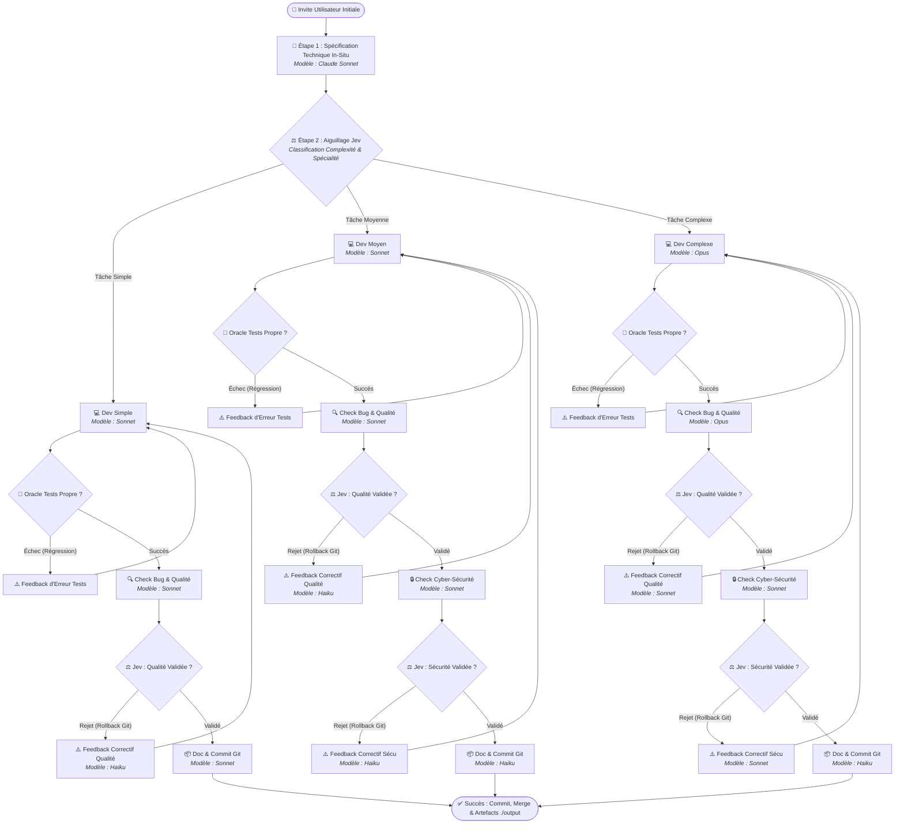
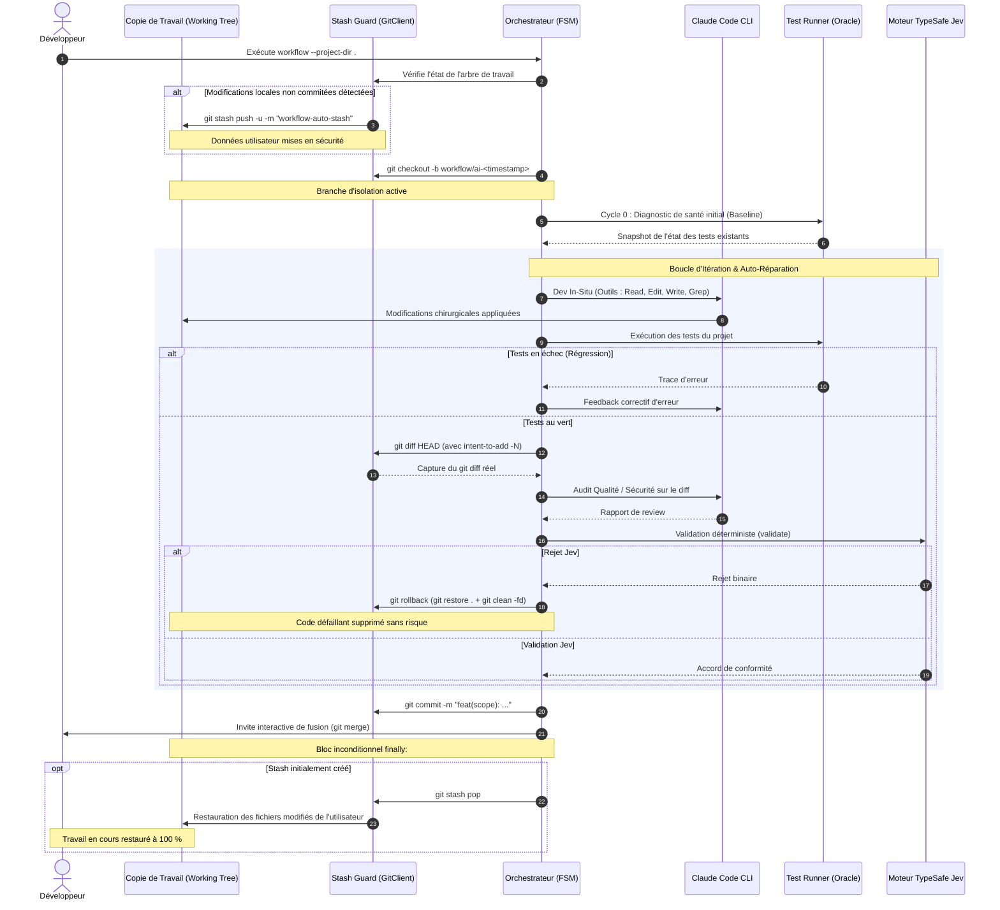

# 🤖 Workflow-Claude-Code : Orchestrateur Multi-Agents Claude & TypeSafe Jev

[](https://www.python.org/downloads/)
[](https://github.com/GirardotN/Workflow-Claude-Code)
[](https://github.com/GirardotN/Workflow-Claude-Code/actions)
[](https://docs.anthropic.com/en/docs/agents-and-tools/claude-code/overview)
[](https://typesafe.ai)
[](#-contraintes-fondamentales--z%C3%A9ro-cr%C3%A9dit-api-claude)
[](LICENSE)

**`Workflow-Claude-Code` est un orchestrateur multi-agents autonome basé sur une Machine à États Finis (FSM) déterministe qui automatise l'intégralité du cycle de conception logicielle : spécification technique, développement in-situ, oracle de tests automatisé, double audit qualité & sécurité, documentation d'ingénierie et commit sémantique.**

Conçu pour les ingénieurs logiciels exigeants et les équipes produit en entreprise, il réconcilie la puissance générative des modèles de pointe d'Anthropic (**Opus, Sonnet, Haiku**) et la vélocité déterministe du moteur de décision **TypeSafe Jev** (System One / Decide).

Il neutralise définitivement les écueils critiques des agents autonomes conventionnels : **zéro crédit API développeur consommé** grâce à l'exploitation de la session locale Claude CLI (Claude Pro / Max 5x), **zéro perte de données** grâce au mécanisme de sécurité **Stash Guard**, et **zéro hallucination de régression** grâce à un diagnostic initial par **Oracle de Test (Baseline Cycle 0)**.

---

### ⚖️ Tableau Comparatif Synthétique

| Dimension Critique | Développement Manuel | Scripts d'Agents Naïfs (LLM Wrapper) | **Workflow-Claude-Code** |
| :--- | :--- | :--- | :--- |
| **Coût d'API Claude** | Gratuit (abonnement web) mais chronophage | Facturation exponentielle au token (`ANTHROPIC_API_KEY`) | **0 € de crédits API** (Session locale Claude CLI Max 5x) |
| **Sécurité du Code Local** | Totale (contrôle humain) | **Élevée** (risque d'écrasement ou de destruction `git clean -fd`) | **Hermétique (Stash Guard)** : `git stash` + `finally: git stash pop` |
| **Validation des Tests** | Manuelle | Ignorée ou aveugle aux échecs préexistants | **Oracle Baseline (Cycle 0)** avec auto-guérison et normalisation anti-jitter |
| **Isolation Cognitive** | Dépend de la rigueur du relecteur | Contexte saturé provoquant des biais de confirmation | **Isolation Stricte** : La revue qualité ne voit que le code brut ou le diff |
| **Vitesse d'Arbitrage** | Lente (attente de review humaine) | Lente (invocations LLM coûteuses pour un oui/non) | **Instantanée & Déterministe** via TypeSafe Jev (classification/probabilité) |
| **Gestion Multiplateforme** | Manuelle | Souvent bloqué sous Windows (`claude.cmd`, encodage CP1252) | **Universelle** (Linux, macOS, Windows avec `comspec` sécurisé & UTF-8) |
| **Résilience du Parsing** | N/A | Crashe si du code généré contient des accolades `{}` | **Parseur lexical d'accolades équilibrées** insensible aux imbrications |
| **Empreinte Système** | N/A | Bloatware lourd (LangChain, autogen, 50+ dépendances) | **Zero Bloatware** : Seulement 2 dépendances légères (`requests`, `dotenv`) |

---

## ⚡ Démarrage Rapide (Quickstart en 3 Minutes)

### 1. Prérequis Système
- **Node.js (v18+)** : Requis pour faire tourner le CLI officiel Claude Code.
- **Python 3.10 ou supérieur**.
- **Git** installé et configuré (`git config user.name` et `user.email`).
- **Session Claude active** : Installez et authentifiez votre session Claude Pro / Max 5x :
  ```bash
  npm install -g @anthropic-ai/claude-code
  claude auth login
  ```
  *(Vérifiez que la commande `claude --version` répond sans erreur).*

> [!NOTE]
> Une clé API **TypeSafe** pour le modèle Jev est facultative. Si aucune variable `TYPESAFE_API_KEY` n'est configurée, l'orchestrateur active automatiquement son moteur de simulation heuristique local haute performance.

---

### 2. Installation Recommandée (Globale via `pipx`)

Grâce au standard **PEP 621** configuré dans `pyproject.toml`, l'application s'installe en commande système universelle isolée de vos environnements virtuels système :

```bash
# 1. Cloner le dépôt officiel
git clone https://github.com/GirardotN/Workflow-Claude-Code.git
cd Workflow-Claude-Code

# 2. Installer globalement via pipx en mode éditable
pipx install --editable .

# 3. Vérifier la disponibilité immédiate des commandes CLI
workflow --help
# (ou commande équivalente : workflow-claude --help)
```

<details>
<summary><b>Alternative : Installation via Environnement Virtuel Classique (venv)</b></summary>

#### Linux & macOS
```bash
python3 -m venv venv
source venv/bin/activate
pip install -r requirements.txt
pip install -e .
```

#### Windows (PowerShell ou Invite de commandes CMD)
```cmd
python -m venv venv
venv\Scripts\activate
pip install -r requirements.txt
pip install -e .
```
</details>

---

### 3. Vos Premières Commandes en Action

#### Cas A : Refactoring In-Situ dans un Projet Existant (Recommandé)
Naviguez dans n'importe quel dépôt Git local et lancez l'orchestrateur avec `--project-dir` :
```bash
workflow --project-dir /chemin/vers/mon-projet "Modifie la fonction de tri dans l'onglet des transactions pour ordonner par date décroissante"
```
*L'orchestrateur analyse le dépôt, crée une branche isolée `workflow/ai-<timestamp>`, modifie le composant ciblé, exécute les tests, valide le `git diff`, et vous invite interactivement à fusionner.*

#### Cas B : Génération d'un Module Autonome (Mode Standalone)
Pour concevoir un service complet sans l'intégrer à un dépôt existant :
```bash
workflow --standalone "Créer un service FastAPI d'authentification JWT avec rate limiting Redis"
```
*La solution complète nettoyée, sa documentation et son rapport d'audit sont immédiatement persistés dans le répertoire `./output`.*

#### Cas C : Simulation Déterministe / Hors-Ligne (`--mock`)
Pour valider le comportement de la FSM, de vos hooks ou de votre CI sans appel réseau ni sollicitation du CLI :
```bash
workflow --mock "Générer un module de calcul matriciel en Rust"
```

---

## 🏛️ Architecture & Modèle Mental

L'orchestrateur repose sur une architecture à deux niveaux :
1. **Système Deux (Cognition Profonde & Synthèse)** : Délégué aux modèles Claude d'Anthropic (Opus, Sonnet, Haiku) exécutés en mode headless non-interactif (`claude -p`).
2. **Système Un (Décision Binaire Réflexe & Routage Déterministe)** : Délégué au modèle **TypeSafe Jev** via classification stricte ou probabilité (`noul`/`binary`).

---

### 🔄 Diagramme de Flux du Workflow Multi-Agents (FSM)



---

### 🛡️ Diagramme de Séquence : Mécanisme Stash Guard & Isolation Transactionnelle

Ce diagramme illustre comment le bloc Python `finally:` immunise le développeur contre toute perte de données lors des phases d'édition destructive ou de rejet :



---

### 📊 Matrice des Rôles et Modèles Alloués

L'orchestrateur optimise la distribution des modèles selon le coût cognitif de chaque tâche :

| Étape / Responsabilité | Tâche Simple | Tâche Moyenne | Tâche Complexe | Justification Cognitive & Économique |
| :--- | :--- | :--- | :--- | :--- |
| **1. Exploration & Spécification** | **Sonnet** | **Sonnet** | **Sonnet** | Excellente compréhension contextuelle et cartographie du codebase. |
| **2. Aiguillage Complexité & Rôle** | **Jev** (`choice`) | **Jev** (`choice`) | **Jev** (`choice`) | Latence ultra-faible (< 200 ms), réponse typée stricte sans blabla. |
| **3. Agent de Développement** | **Sonnet** | **Sonnet** | **Opus** | Sonnet pour les tâches directes ; Opus pour le raisonnement architectural profond. |
| **4. Oracle de Tests (Vérification)** | `TestRunner` | `TestRunner` | `TestRunner` | Détection native d'environnement (`pytest`, `npm`, `cargo`, `go`). |
| **5. Audit Bug & Qualité** | **Sonnet** | **Sonnet** | **Opus** | Évaluation intransigeante du code produit ou du `git diff`. |
| **6. Décision Qualité** | **Jev** (`noul`) | **Jev** (`noul`) | **Jev** (`noul`) | Arbitrage binaire probabiliste strict sans complaisance. |
| **7. Synthèse Feedback Qualité** | **Haiku** | **Haiku** | **Sonnet** | Résumé percutant en puces sans surcharge de tokens ; Sonnet pour le complexe. |
| **8. Audit Cyber-Sécurité** | *(Non requis)* | **Sonnet** | **Sonnet** | Détection des injections, secrets, failles OWASP Top 10. |
| **9. Décision Sécurité** | *(Non requis)* | **Jev** (`noul`) | **Jev** (`noul`) | Tolérance zéro aux signaux critiques d'anomalie. |
| **10. Synthèse Feedback Sécurité** | *(Non requis)* | **Haiku** | **Sonnet** | Recommandations chirurgicales réinjectées à l'agent de dev. |
| **11. Documentation & Commit Git** | **Sonnet** | **Haiku** | **Haiku** | Formatage sémantique et commit conventionnel standardisé. |

---

## 🍳 Guide d'Utilisation Avancé (Cookbooks)

### Cookbook 1 : Refactoring In-Situ dans un Projet TypeScript / React

**Contexte :** Vous devez modifier la fonction de tri d'un composant tableau dans une grande application React comprenant des milliers de fichiers, `node_modules` et des fichiers non suivis.

```bash
workflow --project-dir /home/dev/frontend-app \
         --branch \
         "Modifie le tableau des utilisateurs dans UserTable.tsx pour intégrer un tri par date d'inscription décroissante et ajoute un badge d'ancienneté"
```

#### Ce qui se passe sous le capot :
1. **Filtrage des répertoires lourds :** Claude reçoit l'ordre strict d'ignorer `node_modules`, `.next`, `dist`, `.git`.
2. **Intent-to-Add (`git add -N .`) :** Si Claude crée un sous-composant `Badge.tsx`, Git refuse habituellement de l'inclure dans `git diff` tant qu'il n'est pas indexé. `Workflow-Claude-Code` exécute automatiquement `git add -N .` : le nouveau fichier apparaît immédiatement dans le diff unifié sans forcer un staging complet.
3. **Audit Qualité sur le Diff :** L'agent de review vérifie l'absence de re-renders inutiles et la gestion stricte des types TypeScript.
4. **Commit Conventionnel :** `feat(users): add descending registration sorting and seniority badge`.

---

### Cookbook 2 : Correction de Bug Python / FastAPI avec Auto-Réparation TDD

**Contexte :** Une fonction de calcul de taxe dans une API FastAPI fait échouer la suite de tests `pytest`. Vous demandez à l'orchestrateur de résoudre le bogue en s'appuyant sur les tests.

```bash
workflow --project-dir /home/dev/billing-service \
         --run-tests \
         "Corrige le calcul de la TVA au taux réduit dans services/tax.py qui lève une exception sur les montants nuls"
```

#### Déroulé de la boucle d'auto-guérison :
1. **Baseline Cycle 0 :** L'orchestrateur exécute `pytest`. Si un test legacy sans rapport échouait déjà, il enregistre son empreinte textuelle normalisée pour ne pas en tenir rigueur à l'IA.
2. **Modification In-Situ :** Claude applique son correctif sur `services/tax.py`.
3. **Échec des tests au Cycle 1 :** `pytest` retourne le code d'erreur `1` avec la trace d'erreur (`AssertionError: expected 0.0, got None`).
4. **Réinjection de la trace :** L'orchestrateur intercepte la sortie stderr/stdout du runner et la transmet au modèle de développement :
   ```text
   La modification apportée a provoqué des régressions ou des échecs dans les tests du projet.
   COMMANDE DE TEST : pytest
   TRACE D'ERREUR DES TESTS :
   FAILED tests/test_tax.py::test_zero_amount - AssertionError: expected 0.0, got None
   Corrige immédiatement le code dans les fichiers du projet pour que les tests réussissent.
   ```
5. **Auto-Correction & Oracle Vert :** Claude ajuste la condition aux limites. Les tests passent à 100 %. L'orchestrateur passe alors au check Qualité Jev.

---

### Cookbook 3 : Intégration CI/CD ou Scripts Batch (Mode Zero Interaction)

Pour automatiser des migrations de code ou des mises à niveau de dépendances sur plusieurs dizaines de microservices dans un pipeline sans intervention humaine :

```bash
workflow --project-dir /srv/workspace/microservice \
         --commit \
         --merge \
         -y \
         --run-tests \
         "Migre l'ensemble des requêtes SQLAlchemy v1.4 vers la syntaxe 2.0 select()"
```

> [!TIP]
> La combinaison `--commit --merge -y` garantit une exécution entièrement non-bloquante : le commit est forgé dès validation, le merge dans la branche source est exécuté automatiquement, et la branche temporaire est détruite.

---

## ⚙️ Guide de Référence des Paramètres & Configuration

### 1. Arguments de la Ligne de Commande (`cli.py`)

| Argument CLI | Type | Défaut | Description Détaillée |
| :--- | :--- | :--- | :--- |
| `prompt` | `string` | *(Prompt démo)* | Description succincte de la tâche de développement, refactoring ou création. |
| `--project-dir` | `path` | `None` (auto `.`) | Chemin du projet cible. Active automatiquement le mode In-Repo si c'est un dépôt Git. |
| `--standalone` | `flag` | `False` | Force la génération d'un fichier source neuf dans `./output` sans toucher au projet hôte. |
| `--commit` | `flag` | `False` | Crée automatiquement le commit Git conventionnel après validation de la solution. |
| `--branch` | `flag` | `True` | Isole les modifications sur une branche dédiée `workflow/ai-<timestamp>`. |
| `--no-branch` | `flag` | — | Désactive l'isolation par branche et travaille directement sur la branche active. |
| `--merge` | `flag` | `False` | Fusionne automatiquement la branche d'isolation dans la branche source en fin de succès. |
| `--allow-bash` | `flag` | `False` | Autorise l'agent Claude à exécuter des commandes Bash arbitraires *(sandboxé par défaut)*. |
| `--run-tests` | `flag` | `True` | Exécute automatiquement la suite de tests du projet hôte comme oracle de vérité. |
| `--no-tests` | `flag` | — | Désactive l'exécution des tests du projet hôte. |
| `-y`, `--yes` | `flag` | `False` | Répond oui automatiquement à toutes les invites interactives (merge, retour branche). |
| `--mock` | `flag` | `False` | Active le mode simulation complète (sans aucun appel réseau ni invocation CLI). |
| `--max-retries` | `int` | `4` | Nombre maximum de cycles de rétroaction corrective (Circuit Breaker anti-boucle). |
| `--workspace` | `path` | `./output` | Répertoire de destination des artefacts persistés (patchs, documentation, audit). |
| `-v`, `--verbose` | `flag` | `False` | Active les logs de débogage détaillés avec horodatage dans la console. |

---

### 2. Configuration d'Environnement (`.env` ou `config.json`)

Le système résout la configuration selon l'ordre de priorité strict suivant :  
**Arguments CLI > Préférences Utilisateur (`config.json`) > Variables d'Environnement (`.env`) > Valeurs par Défaut.**

#### Fichier d'Environnement Local (`.env`)
Copiez [.env.example](.env.example) à la racine de votre projet :

```ini
# =============================================================================
# CONFIGURATION TYPESAFE JEV API (SYSTÈME UN DÉCISIONNEL)
# =============================================================================
TYPESAFE_API_KEY=votre_cle_api_ici
TYPESAFE_API_URL=https://api.typesafe.ai/v1/systemone
TYPESAFE_FALLBACK_URL=https://api.typesafe.ai/v1/decide
TYPESAFE_TIMEOUT_SECONDS=30.0

# =============================================================================
# CONFIGURATION CLAUDE CODE CLI (SYSTÈME DEUX COGNITIF)
# =============================================================================
# Chemin explicite facultatif si non détecté automatiquement dans le PATH
# CLAUDE_BIN=/usr/local/bin/claude
CLAUDE_TIMEOUT_SECONDS=180

# =============================================================================
# GARDE-FOUS, ISOLATION ET SÉCURITÉ
# =============================================================================
MAX_WORKFLOW_RETRIES=4
ALLOW_BASH=0
USE_BRANCH=1
RUN_TESTS=1
ALLOW_DIRTY=0
MOCK_SERVICES=0
```

#### Fichier Global Utilisateur (`~/.config/workflow-claude/config.json`)
Pour partager des règles par défaut sur l'ensemble de vos dépôts :
```json
{
  "allow_bash": false,
  "run_tests": true,
  "use_branch": true,
  "allow_dirty": false
}
```

---

## 🔬 Sous le Capot : Ingénierie & Sécurité Enterprise-Grade

### 1. Stash Guard : L'Anti-Data Loss Inconditionnel

Dans un environnement de développement réel, un ingénieur a presque toujours des fichiers non enregistrés ou des modifications partielles sur sa copie de travail (*dirty tree*).

> [!CAUTION]
> Les agents autonomes classiques exécutent souvent `git clean -fd` ou `git checkout .` lorsqu'une modification échoue, détruisant définitivement les heures de travail non commitées du développeur.

`Workflow-Claude-Code` implémente le pattern **Stash Guard** :
1. Dès l'initialisation, si `is_working_tree_clean()` retourne `False`, l'orchestrateur met immédiatement de côté l'intégralité du travail en cours (fichiers modifiés et nouveaux fichiers créés) :
   ```bash
   git stash push -u -m "workflow-auto-stash-<timestamp>"
   ```
2. L'ensemble de la FSM est encapsulé dans un bloc `try: ... finally:`.
3. Qu'il y ait succès, rejet, crash d'un sous-processus, timeout réseau ou interruption clavier volontaire (`Ctrl+C`), le bloc `finally` exécute invariablement :
   ```python
   if stashed and self.git:
       self.git.stash_pop()
   ```
4. En cas de conflit éventuel lors du `stash_pop()`, l'orchestrateur ne force jamais : il alerte l'utilisateur et conserve son stash intact dans l'historique Git.

---

### 2. Oracle Baseline & Normalisation Anti-Jitter

Deux écueils fréquents polluent la validation automatisée des tests par les IA :
1. **Les tests préexistants déjà cassés** : Imputer à Claude un échec présent avant son intervention provoque des boucles de feedback infinies sur du code hors-périmètre.
2. **Le jitter de millisecondes** : Des frameworks comme `pytest` ou `jest` affichent des durées variables (`in 0.42s` vs `in 0.45s`). Une comparaison de chaînes brute considérerait à tort deux sorties identiques comme un changement d'état.

**L'implémentation de l'Orchestrateur résout ces deux problèmes :**
- **Cycle 0 (Baseline) :** Avant toute modification, la suite de tests est lancée. Si elle échoue initialement, son statut et son empreinte sont mémorisés (`report.baseline_tests_passed = False`).
- **Normalisation Déterministe (`normalize_test_output`) :**
  ```python
  def normalize_test_output(output: str) -> str:
      cleaned = re.sub(r"\b\d+(\.\d+)?\s*(s|ms|seconds?)\b", "", output, flags=re.IGNORECASE)
      cleaned = re.sub(r"\(duration:\s*\d+(\.\d+)?s\)", "", cleaned, flags=re.IGNORECASE)
      cleaned = re.sub(r"(\[|\()\s*\d+%\s*(\]|\))", "", cleaned)
      return re.sub(r"\s+", " ", cleaned).strip()
  ```
  Si la suite de tests échoue après le dev mais que la sortie normalisée est rigoureusement identique à la baseline du Cycle 0, l'orchestrateur comprend qu'il ne s'agit pas d'une régression causée par l'agent et poursuit le cycle !

---

### 3. Sécurité des Sous-Processus & Résilience Windows

Sous Windows, `claude` est couramment déployé sous la forme d'un script batch Node.js (`claude.cmd`). Les développeurs ont tendance à utiliser `subprocess.run(..., shell=True)` pour pallier le fait que Windows n'exécute pas directement les fichiers batch.

> [!WARNING]
> L'utilisation de `shell=True` sous Windows rend l'application vulnérable à l'injection de commandes arbitraires si le prompt utilisateur contient des caractères réservés (`&`, `|`, `%`, `^`).

`Workflow-Claude-Code` applique les règles de sécurité suivantes :
1. **Bannissement absolu de `shell=True`** : L'argument `shell=False` est rigoureusement forcé.
2. **Encapsulation Sécurisée par `comspec`** :
   ```python
   if os.name == "nt" and self.binary_path.lower().endswith((".cmd", ".bat")):
       comspec = os.environ.get("COMSPEC", "cmd.exe")
       exec_cmd = [comspec, "/d", "/c", self.binary_path] + cmd[1:]
   ```
   Le commutateur `/d` désactive l'exécution des commandes d'AutoRun du Registre Windows, neutralisant les vecteurs de détournement.
3. **Neutralisation Linguistique Git (`LC_ALL=C`)** : Les sous-processus Git injectent systématiquement `env={"LC_ALL": "C"}` pour garantir que les retours porcelain et les messages d'erreurs soient prévisibles quelle que soit la langue de l'OS hôte.

---

### 4. Parseur Lexical d'Accolades Équilibrées

Lorsque Claude retourne sa réponse en format JSON structuré (`--output-format json`), le payload contient fréquemment des fragments de code comprenant eux-mêmes des accolades imbriquées (classes TypeScript, dictionnaires Python, blocs C#) :

```json
{"type": "result", "result": "function compute() { if (true) { return { a: 1, b: { c: 2 } }; } }"}
```

Les expressions régulières non-gloutonnes (`re.search(r"\{.*?\}")`) s'arrêtent dès la première accolade fermante interne, corrompant le décodage JSON.

**L'implémentation de `clients/claude_cli.py` intègre un automate d'états lexical à profondeur variable :**
```python
depth = 0
in_string = False
escape = False
for i in range(start_idx, len(raw_stdout)):
    char = raw_stdout[i]
    if escape:
        escape = False
        continue
    if char == "\\":
        escape = True
        continue
    if char == '"':
        in_string = not in_string
        continue
    if not in_string:
        if char == "{":
            depth += 1
        elif char == "}":
            depth -= 1
            if depth == 0:
                # Bloc JSON complet et équilibré identifié avec succès
                candidate = raw_stdout[start_idx : i + 1]
                data = json.loads(candidate)
```
Cette logique garantit qu'aucune chaîne de caractères n'est tronquée, même en présence d'accolades échappées à l'intérieur de chaînes littérales de code source.

---

## 🛠️ Dépannage, FAQ & Diagnostics

### Q1 : Que faire si le binaire `claude` est introuvable ?
**Symptôme :** `ClaudeCliError: Binaire Claude introuvable au chemin : 'claude'`.  
**Diagnostic :** L'orchestrateur recherche le binaire dans :
1. La variable `CLAUDE_BIN`
2. Le `PATH` système via `shutil.which`
3. Les répertoires de versions de Claude (`~/.config/Claude/claude-code/<version>/claude`)
4. `%APPDATA%\npm\claude.cmd`, `%LOCALAPPDATA%`, et `~/.npm-global/bin/claude`

**Résolution :**
- Vérifiez où se trouve votre binaire via `which claude` (Linux/macOS) ou `where claude` (Windows).
- Définissez la variable dans votre `.env` :
  ```ini
  CLAUDE_BIN=/chemin/absolu/vers/claude
  ```

---

### Q2 : Pourquoi le message `Session Claude Code non authentifiée` apparaît-il ?
**Symptôme :** `ClaudeCliError: Session Claude Code non authentifiée. Erreur : Not logged in`.  
**Résolution :** Lancez simplement la commande officielle d'authentification interactive dans votre terminal :
```bash
claude auth login
```
Une fois le jeton validé dans votre navigateur, `Workflow-Claude-Code` fonctionnera sans aucune saisie complémentaire.

---

### Q3 : Comment réagir si `git stash pop` échoue après le workflow ?
**Symptôme :** `Stash Guard : Conflit de fusion détecté lors de la restauration du stash`.  
**Explication :** Vous avez modifié manuellement un fichier pendant que Claude éditait ce même fichier sur sa branche isolée.  
**Résolution :**
Vos modifications ne sont pas perdues ! Elles restent stockées dans le stash Git :
```bash
git stash list
# Visualiser le patch de votre travail :
git stash show -p stash@{0}
# Réappliquer manuellement :
git stash apply stash@{0}
```

---

### Q4 : Que faire lorsque le Circuit Breaker se déclenche (`MAX_WORKFLOW_RETRIES` atteint) ?
**Symptôme :** `Circuit breaker : Nombre maximum d'itérations (4) atteint. Arrêt forcé`.  
**Explication :** Le code produit a été rejeté 4 fois d'affilée par l'audit de qualité ou par la suite de tests. Pour éviter une boucle infinie de tokens, le travail est stoppé.  
**Résolution :**
1. L'orchestrateur a automatiquement effectué un rollback propre pour ne laisser aucun fichier corrompu.
2. Consultez le fichier d'audit généré dans `output/WORKFLOW_AUDIT.md` pour lire les critiques exactes formulées par l'agent de review.
3. Précisez votre prompt initial pour lever les ambiguïtés architecturales, ou augmentez temporairement le seuil :
   ```bash
   workflow --max-retries 6 "..."
   ```

---

## 📂 Artefacts Persistés (`./output`)

À chaque fin d'exécution, l'orchestrateur consigne l'ensemble des résultats dans le dossier configuré (par défaut `./output`) :

1. **`LATEST_PATCH.diff`** *(Mode In-Repo)* : Le patch unifié exact prêt à être inspecté ou appliqué via `git apply`.
2. **`generated_solution.<ext>`** *(Mode Standalone)* : Le fichier source produit avec extension dynamique détectée (`.py`, `.ts`, `.tsx`, `.cs`, etc.).
3. **`GENERATED_DOC.md`** : La documentation technique de la solution ainsi que la proposition de commit conventionnel.
4. **`WORKFLOW_AUDIT.md`** : L'historique chronométré et transparent de toutes les transitions de la machine à états (modèles invoqués, durée de chaque étape, révisions et feedbacks).

---

## 🧪 Tests Unitaires & Intégration Continue (CI/CD)

Le projet intègre une suite de **27 tests unitaires hermétiques** qui valident chaque composant critique sans dépendance réseau :
- Transitions d'états des 3 branches (Simple, Moyenne, Complexe).
- Déclenchement et respect du Circuit Breaker.
- Isolation stricte des contextes (aucun prompt de spécification transmis à la review qualité).
- Robustesse du Stash Guard face aux dépôts modifiés et gestion des conflits.
- Capture des fichiers non suivis créés (*untracked new files*) via `git add -N`.
- Diagnostic de santé initial (Baseline Cycle 0) et normalisation anti-jitter des tests.
- Détection des frameworks de test pluriel et singulier (`tests/` vs `test/`).
- Parseur lexical d'accolades équilibrées face aux JSON imbriqués.

### Lancer la suite de tests en local :
```bash
python3 -m unittest discover -s tests -v
```

```text
Ran 27 tests in 5.1s

OK
```

### Matrice CI/CD GitHub Actions (`.github/workflows/ci.yml`)
Chaque commit et pull request est automatiquement testé sur une matrice **9 environnements** :
- **Systèmes d'exploitation :** Ubuntu Linux, macOS, Windows
- **Versions Python :** 3.10, 3.11, 3.12

---

## 🛡️ Sécurité & Conformité

- **Confidentialité Totale du Code :** Aucun code n'est transmis à des serveurs tiers non autorisés. Les requêtes transitent directement et uniquement entre votre terminal et l'infrastructure d'Anthropic via le CLI officiel.
- **Principe du Moindre Privilège :** L'outil `Bash` est désactivé par défaut. Claude opère via un ensemble d'outils restreints d'inspection et d'édition (`Read`, `Edit`, `Write`, `Grep`, `Glob`).
- **Standardisation PEP 621 :** Empreinte minimale de dépendances pour un audit de sécurité simplifié (`pip audit`).

---

## 📄 Licence

Ce projet est distribué sous **Licence MIT**. Consultez le fichier [LICENSE](LICENSE) pour plus de détails.  
Créé et maintenu par **Nicolas Girardot** (`nicolas.girardot@etu.umontpellier.fr`).
