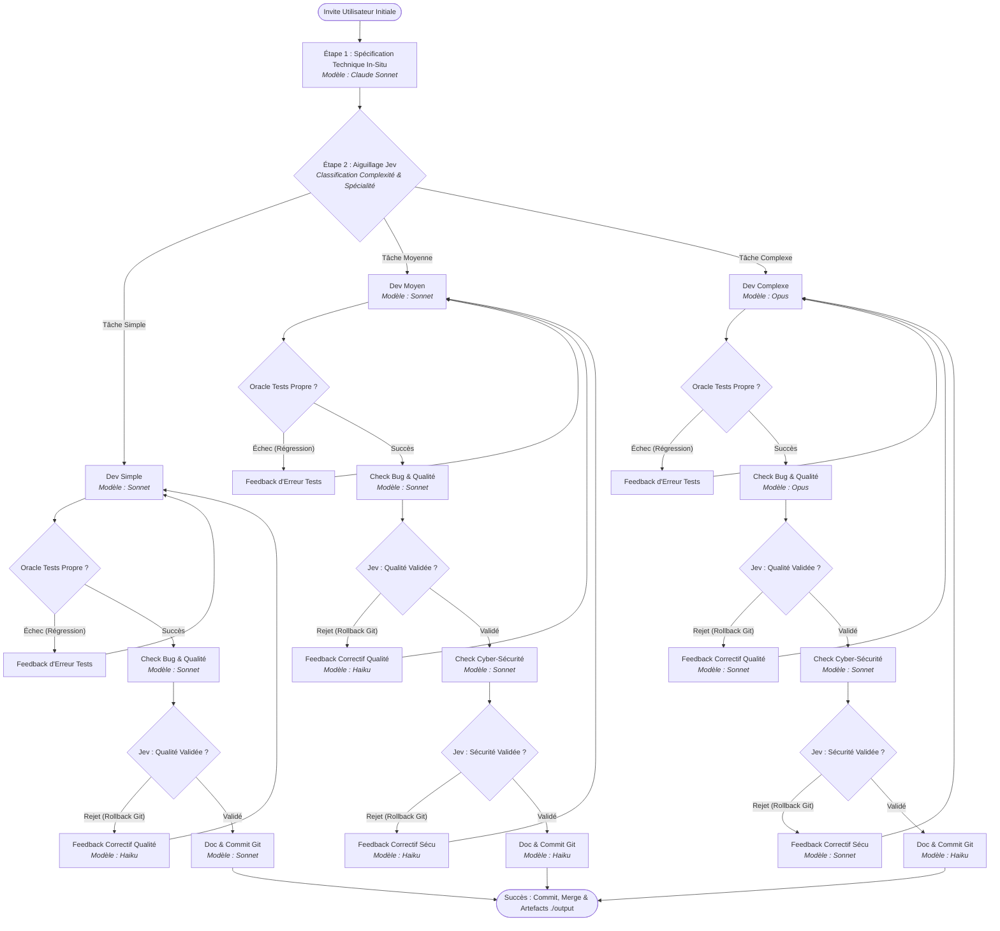
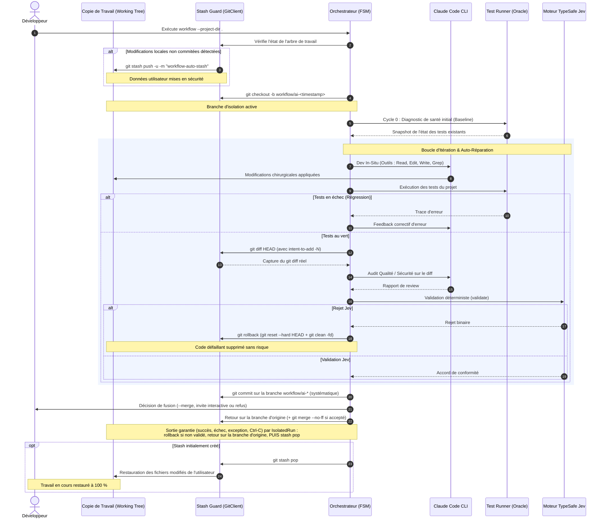

# Architecture & Modèle Mental

Ce document détaille l'architecture interne, le fonctionnement de la Machine à États Finis (FSM) et les choix de conception qui sous-tendent l'orchestrateur **`Workflow-Claude-Code`**.

---

## Modèle Mental à Deux Niveaux (Système 1 / Système 2)

L'architecture s'inspire de la théorie cognitive des processus duaux :

1. **Système Deux (Cognition Profonde, Raisonnement & Synthèse)** :
   - Délégué aux modèles d'Anthropic (**Claude Opus, Sonnet, Haiku**) via le CLI officiel `claude -p` en mode headless.
   - Responsable de la compréhension sémantique du codebase, de la rédaction des spécifications, de l'écriture chirurgicale du code source et des revues critiques.
   - **Économie de tokens** : Aucune clé `ANTHROPIC_API_KEY` n'est requise ; le système s'appuie sur la session locale active de l'utilisateur (Claude Pro / Max 5x).

2. **Système Un (Décision Binaire Réflexe & Routage Déterministe)** :
   - Délégué au moteur décisionnel **TypeSafe Jev** (endpoints `/v1/systemone` et `/v1/decide`).
   - Responsable des arbitrages rapides : choix du niveau de complexité, sélection de la spécialité technique du développeur, et validation/rejet binaire (Qualité et Sécurité).
   - **Avantage** : Latence ultra-faible (< 200 ms), format déterministe (`choice` ou probabilité binaire `noul`/`binary`), et zéro hallucination de complaisance.

---

## Machine à États Finis (FSM) : Flux des 3 Branches

L'orchestrateur évalue dynamiquement le niveau de complexité de la tâche après la phase de spécification initiale et aiguille l'exécution vers l'une des trois branches :

---

## Isolation Transactionnelle Git & Stash Guard

Pour éliminer tout risque de collision avec les modifications locales de l'utilisateur ou de corruption de branche :

---

## Matrice d'Allocation des Modèles

L'orchestrateur adapte la puissance du modèle à l'effort cognitif de chaque phase :

| Étape / Rôle | Tâche Simple | Tâche Moyenne | Tâche Complexe | Justification Cognitive & Économique |
| :--- | :--- | :--- | :--- | :--- |
| **1. Spécification Technique** | **Sonnet** | **Sonnet** | **Sonnet** | Vision architecturale équilibrée et cartographie du codebase. |
| **2. Aiguillage & Rôle Dev** | **Jev** (`choice`) | **Jev** (`choice`) | **Jev** (`choice`) | Déterministe, instantané (< 200 ms), zéro coût de token. |
| **3. Agent de Développement** | **Sonnet** | **Sonnet** | **Opus** | Sonnet pour les tâches directes ; Opus pour les tâches complexes. |
| **4. Oracle de Test** | `TestRunner` | `TestRunner` | `TestRunner` | Exécution native hermétique (`pytest`, `npm`, `cargo`, `go`). |
| **5. Audit Bug & Qualité** | **Sonnet** | **Sonnet** | **Opus** | Rigueur critique ; Opus est intransigeant sur les architectures lourdes. |
| **6. Décision Qualité** | **Jev** (`noul`) | **Jev** (`noul`) | **Jev** (`noul`) | Arbitrage binaire probabiliste impartial. |
| **7. Synthèse Feedback Qualité** | **Haiku** | **Haiku** | **Sonnet** | Puces d'action concises sans surcharge de contexte. |
| **8. Audit Cyber-Sécurité** | *(Non exécuté)* | **Sonnet** | **Sonnet** | Analyse OWASP Top 10, injections, gestion des secrets. |
| **9. Décision Sécurité** | *(Non exécuté)* | **Jev** (`noul`) | **Jev** (`noul`) | Tolérance zéro aux failles logiques ou d'injection. |
| **10. Synthèse Feedback Sécu** | *(Non exécuté)* | **Haiku** | **Sonnet** | Directives correctives impératives. |
| **11. Documentation & Commit** | **Sonnet** | **Haiku** | **Haiku** | Formatage sémantique et commit conventionnel standardisé. |

---

## Isolation Cognitive Stricte

Pour prévenir les biais de confirmation et l'explosion de la fenêtre de contexte :
- **L'Agent Qualité** ne reçoit **que** le code brut ou le `git diff`. Il n'a aucun accès au prompt de spécification initial ni à l'identité du développeur, ce qui garantit une relecture neutre et impartiale.
- **L'Agent Sécurité** reçoit **le code source ET la review qualité** préalable pour identifier les vecteurs d'attaque potentiels.
- **Les Retours Correctifs** sont reformulés sous forme de listes à puces concises sans réinjecter l'intégralité des échanges passés.
